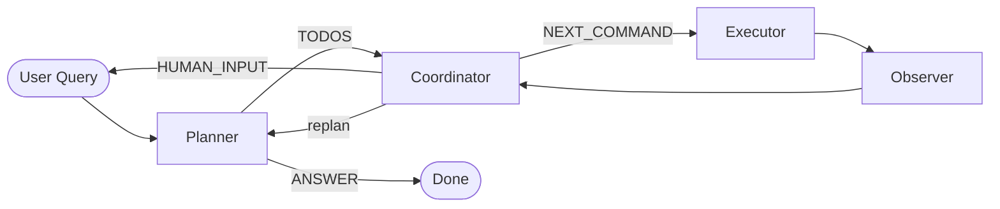

# GitOps Agent

A LangGraph-powered GitOps agent that understands your repository from a **single natural-language query**. It auto-discovers branches, commits, files-per-commit, branch divergence, and working tree state — then plans and executes safe git operations without you spelling out every command.

## Features

- **Rich repository intelligence** — branches, numbered commit index, files changed per commit, file-to-commit map, branch heads, merge-base, and commits unique to each branch
- **Single-query workflows** — ask once; the agent plans, executes, and verifies
- **Selective multi-branch builds** — create a branch from one base and cherry-pick only specific commits from other branches
- **Informational answers** — questions like "which commit added `config.py`?" are answered from live context
- **Safe by default** — blocks force push, branch deletion, and history rewrite unless you explicitly approve
- **Human-in-the-loop** — escalates ambiguous or destructive actions instead of guessing

## Architecture

The agent is a LangGraph state machine with four LLM roles:



| Node | Role |
|------|------|
| **Planner** | Reads full git context, breaks requests into todos or answers directly |
| **Coordinator** | Maps each todo to one safe `git` command using context + history |
| **Executor** | Runs the command in your target repo |
| **Observer** | Verifies whether the current todo was completed |

### Repository context (`git_context.py`)

Before every request, the agent gathers:

| Data | Description |
|------|-------------|
| Branch list | Local branches with tip hash and subject |
| Commit index | Per-branch numbered commits (`#1` = newest) with files changed |
| File → commit map | Which commits touched which files |
| Branch heads | Files present at each branch tip |
| Divergence | Commits on branch X not in default branch, merge-base |
| Working tree | `git status` snapshot |
| Graph | Recent `--all --graph` view |

Branches mentioned in your query are prioritized for deeper indexing.

## Requirements

- Python 3.11+
- [Git](https://git-scm.com/) installed and on `PATH`
- [Groq API key](https://console.groq.com/)

## Setup

1. **Clone and enter the project**

   ```bash
   git clone https://github.com/Mat-hack/agent.git
   cd agent
   ```

2. **Create a virtual environment**

   ```bash
   python -m venv .venv
   # Windows
   .venv\Scripts\activate
   # macOS / Linux
   source .venv/bin/activate
   ```

3. **Install dependencies**

   ```bash
   pip install -r requirements.txt
   ```

4. **Configure environment**

   Create a `.env` file:

   ```env
   GROQ_API_KEY=your_groq_api_key_here

   # Optional: target repository (auto-detected from cwd if omitted)
   REPO_PATH=C:\path\to\your\repo

   # Optional: model and context limits
   GROQ_MODEL=llama-3.3-70b-versatile
   CONTEXT_MAX_BRANCHES=20
   CONTEXT_MAX_COMMITS_PER_BRANCH=30
   CONTEXT_MAX_FILES_PER_BRANCH=200
   ```

5. **Run the agent**

   ```bash
   python main.py
   ```

   Or via LangGraph:

   ```bash
   langgraph dev
   ```

## Usage examples

### Informational queries

```
You: what branches exist?
You: which commit on main modified planner.py?
You: show me commits on feature-x that are not on main
You: what files are on the develop branch?
```

### Simple git operations

```
You: create branch hotfix from main
You: create branch release-v2 from commit 3 on main
You: show status
```

### Selective multi-branch branch creation

This is where the rich context shines — the agent resolves commit numbers and hashes across branches:

```
You: create branch integration from main, then cherry-pick commit 2 from feature-auth and commit 1 from feature-billing
```

The planner will:

1. Read commit `#2` on `feature-auth` and `#1` on `feature-billing` from context
2. Plan: create branch → cherry-pick first commit → cherry-pick second commit
3. Coordinator emits exact `git branch` / `git cherry-pick` commands with real hashes

```
You: make a new branch staging from developer with only commits 3 and 5 from feature-x
```

### Human escalation

If a branch already exists or a cherry-pick conflicts, the agent asks instead of forcing:

```
===== HUMAN INPUT REQUIRED =====
Branch 'release' already exists. Use a different name, switch to it, or delete it?
> release-v2
```

## Project structure

```
agent/
├── main.py           # Interactive CLI entry point
├── graph.py          # LangGraph workflow definition
├── planner.py        # Task planning + direct answers
├── coordinator.py    # Command generation per todo
├── executor.py       # Shell/git execution
├── observer.py       # Todo completion verification
├── git_context.py    # Repository intelligence gathering
├── config.py         # Paths, model, context limits
├── state.py          # Shared graph state schema
├── human.py          # Human input node
├── requirements.txt
└── langgraph.json    # LangGraph Studio config
```

## How commit numbering works

Commits are numbered per branch in the commit index:

- **#1** = newest commit on that branch
- **#2** = second newest
- and so on

When you say *"commit 3 on developer"*, the agent looks up `#3` under the `developer` section in context and uses that hash.

## Configuration reference

| Variable | Default | Description |
|----------|---------|-------------|
| `GROQ_API_KEY` | — | Required Groq API key |
| `REPO_PATH` | auto-detect | Git repository to operate on |
| `GROQ_MODEL` | `llama-3.3-70b-versatile` | LLM used by all nodes |
| `CONTEXT_MAX_BRANCHES` | `20` | Max local branches to index |
| `CONTEXT_MAX_COMMITS_PER_BRANCH` | `30` | Commits per branch in context |
| `CONTEXT_MAX_FILES_PER_BRANCH` | `200` | Files listed per branch head |

## Safety policies

The agent will **not** automatically:

- Delete branches
- Force push
- Run interactive rebase or hard reset
- Modify an existing branch without approval

Destructive or ambiguous operations trigger `HUMAN_INPUT_REQUIRED`.

## Limitations

- Context is capped for performance on very large repos; increase env limits if needed
- Cherry-pick conflicts require manual resolution guidance
- Remote operations (push/fetch) are not blocked but should be used carefully
- The agent runs git commands with `shell=True` in the target repo — only use on repositories you trust

## License

MIT
